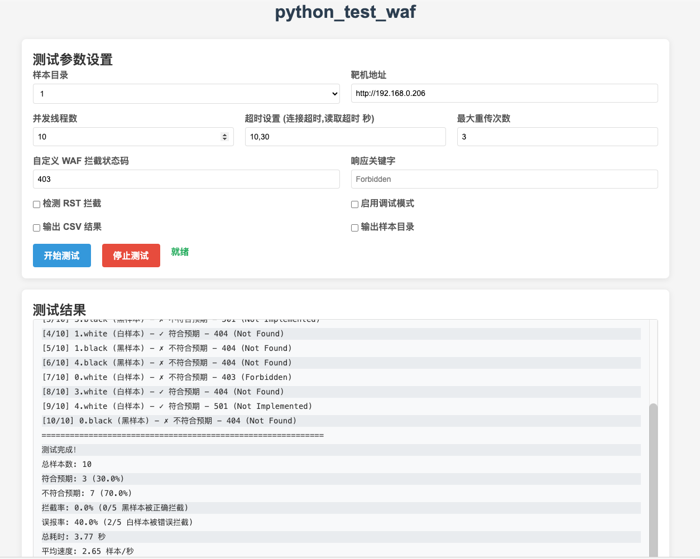
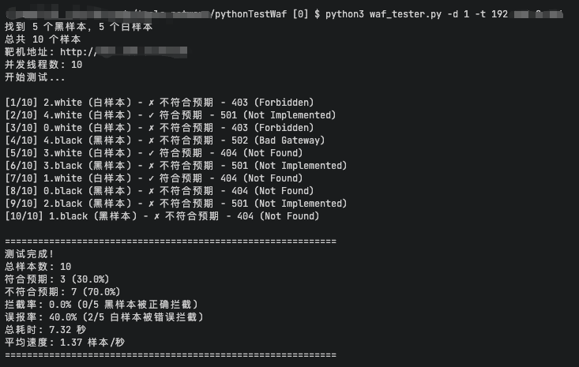

# python_test_waf

用于测试 WAF 是否能够正确拦截黑样本，并允许白样本通过的自动化测试工具。





## 功能特性

- ✅ 支持并发测试，提高测试效率
- ✅ 支持模拟网络丢包，测试 WAF 在不稳定网络环境下的表现
- ✅ 支持自动重传机制，处理网络异常
- ✅ 支持调试模式，输出详细的请求和响应信息
- ✅ 支持输出 CSV 测试结果（带 UTF-8 BOM 头，避免乱码）
- ✅ 支持分类存储样本文件
- ✅ 支持自定义靶机地址和协议
- ✅ 支持自定义并发线程数
- ✅ 提供 WebUI 界面，支持图形化操作
- ✅ 实时显示测试结果，无需等待测试完成
- ✅ 支持样本目录智能识别，自动发现包含测试样本的目录
- ✅ 支持 2 级目录扫描，可使用之前测试生成的目录作为样本目录

## 安装依赖

### 基本依赖（仅命令行工具）
无特殊依赖，使用 Python 标准库即可运行

### 完整依赖（包含 WebUI）
```bash
pip install -r requirements.txt --break-system-packages
```

requirements.txt 包含以下依赖：
- Flask>=3.0.0

## 使用方法

### 命令行工具

#### 基本用法

```bash
python3 waf_tester.py -d 样本目录 -t 靶机地址
```

### WebUI 界面

#### 启动 WebUI

```bash
python3 webui.py
```

WebUI 将在以下地址运行：
- http://localhost:5001
- http://your-ip:5001（可通过网络访问）

#### WebUI 功能

1. **样本目录选择**：自动识别包含 `.black` 或 `.white` 文件的目录，支持 2 级目录
2. **测试参数设置**：
   - 靶机地址（默认：http://127.0.0.1）
   - 并发线程数（默认：10）
   - 超时设置（格式：连接超时,读取超时 秒，默认：10,30）
   - 最大重传次数（默认：3）
   - 自定义 WAF 拦截状态码（默认：403）
   - 检测 RST 拦截
   - 响应关键字匹配
   - 调试模式
3. **输出设置**：
   - 输出 CSV 结果（自动生成带时间戳的文件名）
   - 输出样本目录（自动生成带时间戳的目录名）
4. **实时测试结果**：实时显示测试进度和结果，无需等待测试完成
5. **结果下载**：测试完成后可直接下载 CSV 结果文件

#### WebUI 使用步骤

1. 启动 WebUI 服务
2. 在浏览器中访问 http://localhost:5001
3. 选择样本目录
4. 填写靶机地址和其他测试参数
5. （可选）勾选输出选项，系统会自动生成带时间戳的文件名
6. 点击「开始测试」
7. 实时查看测试结果
8. 测试完成后，可下载 CSV 结果文件
9. 输出选项会自动关闭，保持界面整洁

### 示例

```bash
# 基本测试
python3 waf_tester.py -d 1 -t http://127.0.0.1:21000

# 模拟 10% 丢包率，最大重传 5 次
python3 waf_tester.py -d 1 -t http://127.0.0.1:21000 --loss-rate 0.1 --max-retries 5

# 设置自定义超时：连接超时 15 秒，读取超时 45 秒
python3 waf_tester.py -d 1 -t http://127.0.0.1:21000 --timeout 15,45

# 设置统一超时：连接和读取超时均为 20 秒
python3 waf_tester.py -d 1 -t http://127.0.0.1:21000 --timeout 20

# 启用调试模式
python3 waf_tester.py -d 1 -t http://127.0.0.1:21000 --debug

# 输出 CSV 结果
python3 waf_tester.py -d 1 -t http://127.0.0.1:21000 --output results.csv

# 分类存储样本
python3 waf_tester.py -d 1 -t http://127.0.0.1:21000 --split output_dir

# 综合使用
python3 waf_tester.py -d 1 -t http://127.0.0.1:21000 --timeout 15,45 --max-retries 3 --debug --output results.csv --split output_dir

# 使用自定义状态码 404 作为 WAF 拦截标志
python3 waf_tester.py -d 1 -t http://127.0.0.1:21000 -C 404

# 检测 RST 拦截
python3 waf_tester.py -d 1 -t http://127.0.0.1:21000 -R

# 使用响应 body 中的关键字 "WAF Blocked" 作为拦截标志
python3 waf_tester.py -d 1 -t http://127.0.0.1:21000 -K "WAF Blocked"

# 组合使用多种拦截判断方式
python3 waf_tester.py -d 1 -t http://127.0.0.1:21000 -C 403 -R -K "WAF Blocked"
```

## 命令行参数

| 参数 | 简写 | 说明 | 默认值 |
|------|------|------|--------|
| `--directory` | `-d` | 样本目录 | `1` |
| `--output` | `-o` | 输出 CSV 文件路径（可选，只有明确指定时才输出） | `None` |
| `--target` | `-t` | 靶机地址，支持完整 URL：http://127.0.0.1 或 https://example.com:8443 | `None` |
| `--threads` | `-n` | 并发线程数 | `10` |
| `--split` | `-s` | 输出目录，用于分类存储样本（可选，只有明确指定时才使用） | `None` |
| `--no-auto-dir` | | 不自动创建结果目录（已废弃，保留为兼容性） | `False` |
| `--loss-rate` | | 模拟丢包率 (0.0-1.0) | `0.0` |
| `--max-retries` | | 最大重传次数 | `3` |
| `--timeout` | | 超时设置，格式：连接超时,读取超时（秒） | `10,30` |
| `--debug` | | 启用调试输出 | `False` |
| `-C, --custom-code` | | 自定义 WAF 拦截状态码（与 -R、-K 参数为 OR 关系，满足任一条件即视为被拦截） | `403` |
| `-R, --rst-detect` | | 检测 RST 拦截（与 -C、-K 参数为 OR 关系，满足任一条件即视为被拦截） | `False` |
| `-K, --keyword` | | 响应 body 或响应原因中的关键字，用于判断 WAF 拦截（与 -C、-R 参数为 OR 关系，满足任一条件即视为被拦截） | `None` |

## 样本文件格式

样本文件分为黑样本（`.black` 后缀）和白样本（`.white` 后缀）：

- **黑样本**：应该被 WAF 拦截，返回 403 状态码
- **白样本**：不应该被 WAF 拦截，返回非 403 状态码

### 样本文件内容格式

```
METHOD /path HTTP/1.1
Host: example.com
User-Agent: Mozilla/5.0

请求体内容（可选）
```

示例：

```
GET /test HTTP/1.1
Host: example.com
User-Agent: Mozilla/5.0

param1=value1&param2=value2
```

## 输出说明

### 默认输出

默认情况下，只输出测试结果摘要，不生成任何文件：

```
找到 5 个黑样本，5 个白样本
总共 10 个样本
靶机地址: http://127.0.0.1:21000
并发线程数: 10
开始测试...

[1/10] 1.white (白样本) - ✓ 符合预期 - 404 (Not Found)
[2/10] 4.black (黑样本) - ✓ 符合预期 - 403 (Forbidden)
...

============================================================
测试完成！
总样本数: 10
符合预期: 9 (90.0%)
不符合预期: 1 (10.0%)
总耗时: 0.17 秒
平均速度: 58.24 样本/秒
============================================================

不符合预期的样本:
------------------------------------------------------------
✗ 2.black (黑样本，应被拦截但返回 405)
```

### CSV 输出

使用 `--output` 参数时，会生成 CSV 文件，包含以下字段：
- 文件名
- 样本类型
- 期望行为
- 状态码
- 响应信息
- 是否符合预期

### 样本分类输出

使用 `--split` 参数时，会创建两个子目录：
- `符合预期/`：存储符合预期的样本
- `不符合预期/`：存储不符合预期的样本

## 调试模式

启用调试模式后，会输出详细的请求和响应信息：

```
[调试] 尝试 1/3: 发送请求 - GET http://127.0.0.1:21000/test
[调试] 请求头: {'Host': 'example.com', 'User-Agent': 'Mozilla/5.0'}
[调试] 请求体大小: 0 字节
[调试] 响应: 403 Forbidden
```

## 注意事项

1. 样本文件必须以 `.black` 或 `.white` 为后缀
2. 样本文件中的请求行格式必须正确：`METHOD /path HTTP/1.1`
3. 靶机地址格式：`http://host:port` 或 `https://host:port`
4. 丢包率范围：0.0-1.0（0% 到 100%）
5. 并发线程数建议根据靶机性能调整，避免过载

## 许可证

MIT License